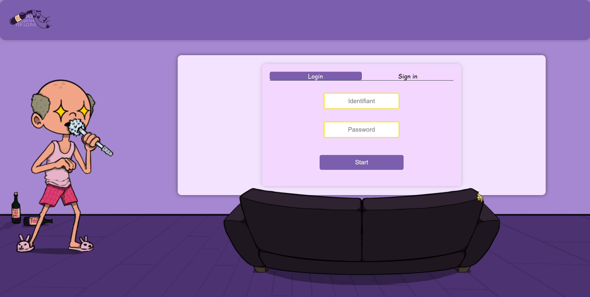

# GroupieTracker 🪢

Welcome to GroupieTracker ! This project is made up of 3 music games playable for up to 6 players



# Prerequisite ⏪

Somes knowledges in this field : 

- The use of Golang 
- The use of HTML, CSS and JavaScript
- The use of Git and for the code management

# Installation 🔧

1. Clone the repository.
```bash
  git clone https://ytrack.learn.ynov.com/git/catom/groupieTracker.git
```
2. Reach in the repository.
```bash
  cd groupieTracker
```

# Start 🧑‍💻

1. Write this command : 
```bash
  go run main.go
```

2. Your application running on port 8080 is available then you can open it in browser. 
If you don't have the message for open it you can write this in your browser:
```bash
  http://[IP]:8080/
```
3. To find out its IP you must launch the command prompt and enter this command:
Windows
```bash
  ipconfig
```
Linux
```bash
  ifconfig
```

4. Other players can run with your IP adress. You must have the same wifi as the host

# How Play ? 🔨

You arrive on the login page.
When you log in you will arrive on the landing page where all the games are represented.

There are 3 different types of games related to music:
    - Blindtest
    - Deaftest
    - Scattegorie

In each game you can host or join a room for play with your friend

1. In Blindtest game, music is played at the start of the round, and you have to be the fastest
possible to find the corresponding song.

2. The Scattegorie game gives a random letter at the start of each round and players must
find words starting with the letter given by the game.

3. The Deaftest game shows you an extract of the lyrics of a song, you then have to find the
title of the original music.

You can see a scoreboard at the end of each game

# Version 🗃️

golang 1.21.0

# Authors 💸

 - [Kilian Moun 🍻](https://github.com/MounKilian)
 - [Tom Calvo 🍻](https://github.com/CalvoTom)
 - [Lucas Marciniak 🍻](https://github.com/Yukojuni)